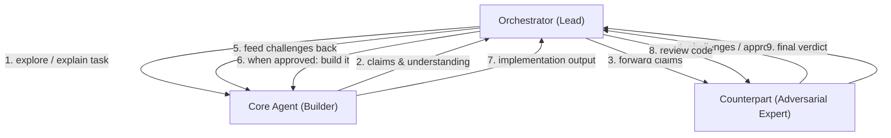

# Add Conversational Pipeline

## Architecture

Three agents in a triangular conversation loop:



**Orchestrator (Lead)** -- Lightweight coordinator. Drives the Q&A loop, routes messages between core and counterpart, decides phase transitions. Uses MCP tools (`delegate`, `done`, `fail`). Does not need to understand the code itself -- just manages the process.

**Core Agent (Builder)** -- Explores codebase, answers questions, builds understanding, writes code. Single session that persists across exploration and implementation phases so context is never lost.

**Counterpart (Adversarial Expert)** -- Independently reads the codebase. Receives the core agent's claims and verifies them. Designed to be skeptical: pokes holes, asks hard questions, catches misunderstandings. Acts as reviewer both pre-implementation (understanding review) and post-implementation (code review).

## Phase Flow

1. **Explore** -- Orchestrator delegates to core agent: "read X, explain how Y works"
2. **Verify Understanding** -- Orchestrator forwards core agent's answer to counterpart: "verify these claims"
3. **Challenge Loop** -- Counterpart returns challenges; orchestrator feeds them back to core agent. Repeat until counterpart returns `APPROVED`.
4. **Build** -- Orchestrator tells core agent: "implement the changes" (same session, full context retained)
5. **Adversarial Review** -- Orchestrator delegates to counterpart: "review this implementation"
6. **Fix Loop** -- If counterpart returns `REQUEST_CHANGES`, orchestrator feeds issues back to core agent. Max 3 cycles.
7. **Complete** -- Orchestrator calls `done()` or `fail()`

## Changes by File

### 1. [src/engine/KosTypes.ts](src/engine/KosTypes.ts) -- Add type

Add `'conversational'` to the `EpicPipelineType` union:

```typescript
export type EpicPipelineType = 'create' | 'fix' | 'investigate' | 'plan' | 'conversational';
```

This is the only type change needed. All downstream `Record<EpicPipelineType, ...>` will get compile errors that guide the remaining edits.

### 2. [src/engine/Orchestrator.ts](src/engine/Orchestrator.ts) -- Add workflow prompt + specialist prompts

**New specialist prompts** (add to `SPECIALIST_PROMPTS`):

- `'counterpart'` -- Adversarial expert identity. Instructs the agent to independently verify claims, be skeptical, search the codebase for evidence, and respond with structured verdicts (`APPROVED` / `CHALLENGED: [issues] `for understanding review, `APPROVE` / `REQUEST_CHANGES` for code review).

**New specialist tool set** (add to `SPECIALIST_TOOLS`):

- `'counterpart': 'Read,Glob,Grep'` -- Read-only, same as reviewer. It must be able to independently verify claims by reading code.

**New workflow constant** `CONVERSATIONAL_WORKFLOW` -- A system prompt that describes the conversational pipeline phases to the orchestrator. It tells the orchestrator to:

1. First delegate to `core` with exploration questions
2. Forward the core agent's answer to `counterpart` for verification
3. Loop challenges back to `core` until counterpart approves
4. Then tell `core` to implement
5. Send implementation to `counterpart` for code review
6. Loop fixes if needed, max 3 cycles

**New exported prompt** `ORCHESTRATOR_CONVERSATIONAL_PROMPT`:

```typescript
export const ORCHESTRATOR_CONVERSATIONAL_PROMPT =
  ORCHESTRATOR_PREAMBLE + ORCHESTRATOR_RULES + CONVERSATIONAL_WORKFLOW;
```

**Update `getSystemPrompt()`** (line ~1469) to add a `case 'conversational'` that returns the new prompt.

**Update `executeDelegation()`** -- Allow the `counterpart` role (same as `architect`/`debugger` for read-only, but this pipeline is not read-only -- it just needs to allow the new role name). No special-casing needed beyond registering the role in `SPECIALIST_PROMPTS` and `SPECIALIST_TOOLS`.

### 3. [resources/mcp/orchestrator_server.py](resources/mcp/orchestrator_server.py) -- Add counterpart role

In the `delegate` tool's `inputSchema`, add `"counterpart"` to the `role` enum (line ~53):

```python
"enum": ["architect", "implementer", "reviewer", "tester", "debugger", "counterpart"],
```

### 4. [src/components/kanban/EpicDetailPanel.vue](src/components/kanban/EpicDetailPanel.vue) -- Add UI option

Add the new pipeline to the three config objects (lines 347-366):

- `pipelineTypes` array: `{ value: 'conversational', label: 'Conversational' }`
- `pipelineColors`: `conversational: 'var(--accent-mauve)'`
- `pipelineDescriptions`: `conversational: 'Explore → Verify → Challenge → Build → Review'`

### 5. [src/engine/AngyEngine.ts](src/engine/AngyEngine.ts) -- No changes needed

The engine spawns orchestrators generically via `spawnEpicOrchestrator()`. It calls `orch.setPipelineType(epic.pipelineType)`, which already flows through to `getSystemPrompt()`. The new pipeline type will work automatically.

## Counterpart Specialist Prompt Design

The counterpart must be designed as an **adversarial expert** -- not a friendly reviewer. Key prompt elements:

- **Identity**: "You are an adversarial technical expert. Your job is to find flaws, gaps, and incorrect assumptions."
- **Skepticism by default**: "Assume claims are wrong until you verify them by reading the actual code."
- **Independent verification**: "Do NOT rely on what the other agent told you. Read the files yourself."
- **Structured output**:
  - For understanding review: `## VERDICT: APPROVED` or `## VERDICT: CHALLENGED` with numbered issues
  - For code review: `## VERDICT: APPROVE` or `## VERDICT: REQUEST_CHANGES` with severity levels (same as existing reviewer)
- **Specific challenges**: "When challenging, ask specific questions that would expose misunderstanding. Reference exact file paths and line numbers."
- **No hand-waving**: "Do not accept vague or high-level descriptions. Demand specifics: which function, which data flow, which edge case."

## What is NOT Changed

- Existing `create`, `fix`, `investigate`, `plan` pipelines -- untouched
- `OrchestratorPool`, `Scheduler`, `ProcessManager` -- no changes needed (they are pipeline-agnostic)
- MCP server structure -- only the role enum is extended
- `HeadlessHandle`, `BranchManager`, `SessionService` -- untouched